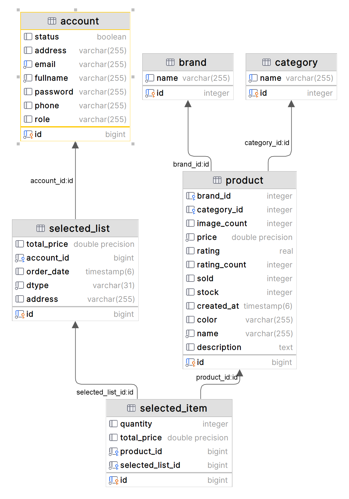

# Getting started

## Database
### Postgres
In this project, I use Postgres as my database.
Postgres is a relational database management system developed 
by PostgreSQL Global Development Group; compare to MySQL,
Postgres is more powerful and has more features, such as
supporting JSON data type, and it is more secure.
<br>
The database is hosted on Docker, and the Docker image is
pulled from Docker Hub. The Docker image is defined in
`docker-compose.yaml` file. To run the database, run
```shell
docker-compose up -d
```
So you can see the database like this, when it is initialized:
[](dia.png)
<br>
You may not see the Cart and Order Entity, because they are
extended from the Selected List Entity, so you can see the dtype on
this table.

Some functions in this app:
- view attractions in `/` page
- see all the products in `/store`
- search items by category and keyword in `/store`
- see product details in `/product/**`
- add items to cart in `/cart/add/` (login required)
- see items in cart in `/cart/` (login required)
- remove items from cart in `/cart/remove/` (login required)
- checkout in `/cart/checkout/` (login required)
- see order history in `/account/` (login required)
- see order details when you are order success in `/order/**` (login required)

That's all for this project, thank you for reading!

## Have a nice day!